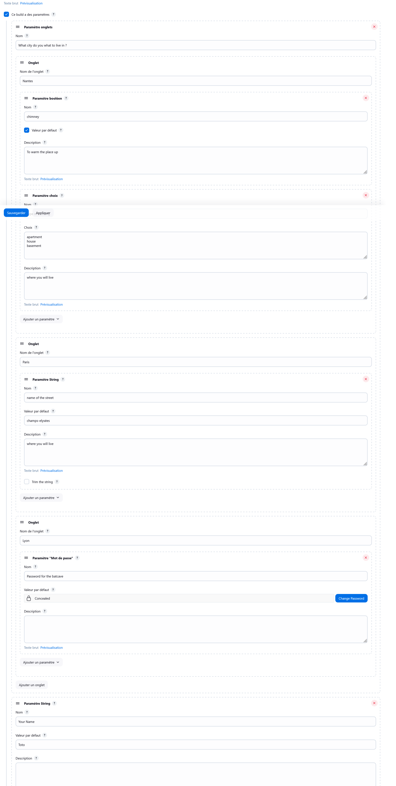
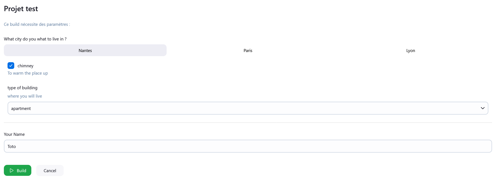
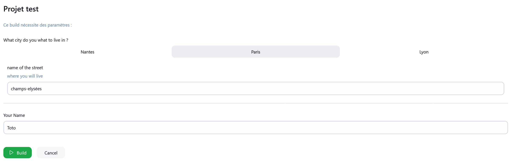

# tab-parameters

## Introduction

This plugin provides Tabs in the "Build with parameters" view.
The style try to match to Jenkins style.
The implementation uses only base Jenkins classes and native and simple HTML/CSS/JS.

Example of build configuration :

Example of "build with parameters" view:
First tab:

Second tab:

Heavily inspired by uno choice plugin.

## Plugin maintenance

This plugin will maybe never receive any new updates and is provided as is.
Right now I don't have the time to fully support this plugin on my own time.

Feel free to fork this plugin and add your features on your fork. If you feel like you could handle the maintenance of
this plugin, you can even try to make it an official plugin. Just credit this repo if you do this.
Maybe this plugin is ready to be included in official plugins. At least I followed the "Publish your plugin guide".

## Getting started

Just add a "Tabs parameter" as you would add any
other [build parameter](https://plugins.jenkins.io/build-with-parameters/)

## Limitations:

* Did not test recursion of tabs
* Not tested rebuild plugin
* Only tested with base Jenkins Parameters
* Cannot do POST requests
* All parameters are passed to the build, even the not visible ones
* No unit tests (shame on me)

## Technical Infos

At first, I tough I needed to reimplement the way the parameters where rendered, which lead me to Jenkins core
territory, something that I don't wanted to try.
Now I think my implementation is not _that_ hacky.

## Issues

Lookup the GitHub Issues tab

## Contributing

See [CONTRIBUTING](https://github.com/jenkinsci/.github/blob/master/CONTRIBUTING.md)

Refer to our [contribution guidelines](https://github.com/jenkinsci/.github/blob/master/CONTRIBUTING.md)

## LICENSE

Licensed under MIT, see [LICENSE](LICENSE.md)

